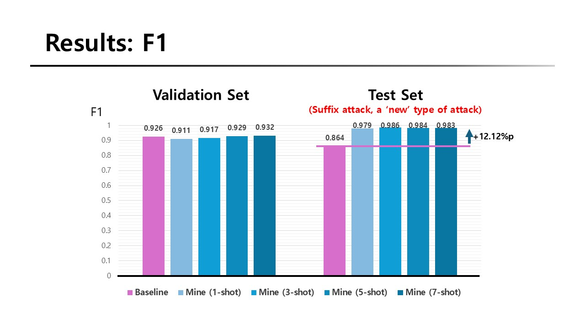
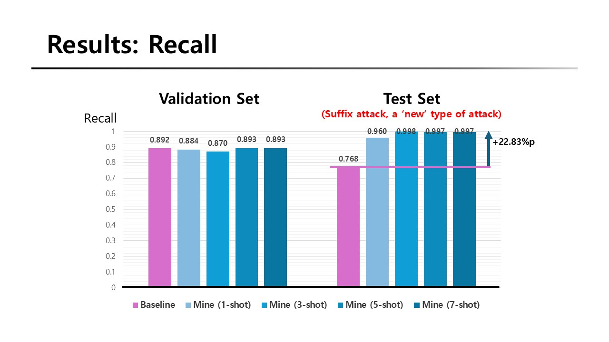

## PromptKiller: Few-shot Detection for LLM Prompt Injection Attacks

**Introduction to NLP Term Project, Fall 2025**
Yeonjun Kim
Dept. of Computer Science and Engineering, Seoul National University

## About this Project

- This project aims to build a robust filter that detects malicious prompt injection attacks before it reaches the LLM.
- **The detector can detect a prompt injection attack in few-shot manner, with a fine-tuned Siamese network based on a pretrained DeBERTa model.**
- The detector can prevent prompt injection in the scenario where we have only a few examples of a novel injection attack. The experiment (which you can try reproducing in `/train`) showed that this approach outperformed the existing cross-entropy-based fine-tuning.
- The weights of the model is stored in `/weights`. (Also available at [HuggingFace](https://huggingface.co/Superfish83/PromptKiller))

## Experiment Settings

**Backbone model**: [DeBERTa 86M](https://huggingface.co/microsoft/deberta-base)

**Datasets**: This project used all or part of each dataset shown below.

- https://www.kaggle.com/datasets/marycamilainfo/prompt-injection-malignant
- https://www.kaggle.com/datasets/arielzilber/prompt-injection-in-the-wild
- https://www.kaggle.com/datasets/mohammedaminejebbar/malicious-prompt-detection-dataset-mpdd
- https://www.kaggle.com/datasets/arielzilber/prompt-injection-suffix-attack

**Results**

For details about the experiment, refer to `presentation.pdf`.

## How to run

### Prerequisites
